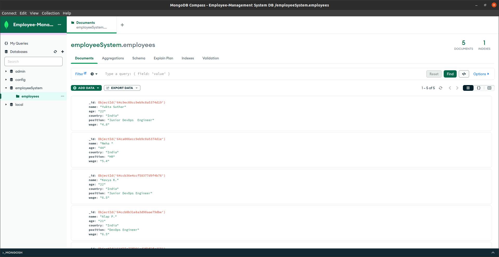

# Employee Management System

 Application Build – <b> Employee Management System </b> 

In this system user can add the employee information likes –name, age, position, salary, and country. 

Technology Used -  

MongoDB: NoSQL database for flexible data storage. 

Express.js: Minimalist web application framework for handling HTTP requests an interacting with the database. 

 React.js: JavaScript library for building interactive user interfaces. 

 Node.js: JavaScript runtime for running the server and handling server-side logic. 

This is a Full Stack Application .

## Screenshot / Output

<h3>Frontend </h3>

<h4>Insert-the-data</h4>

<h4>After adding the data</h4>

<h4>Database  Entry </h4>

Developed by Yukta
